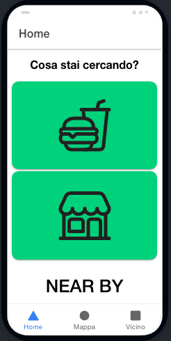
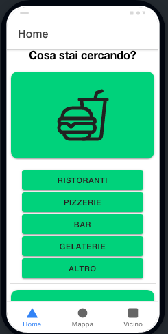
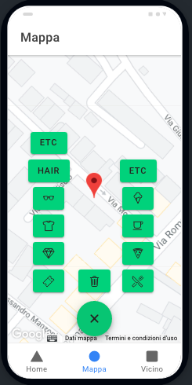
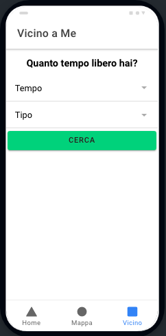

# NearBy

Mobile application developed with Ionic. 
The goal of this project is to offer users the opportunity to know the points of interest located in the center / station area, such as generic shops and restaurants, that surround them and how to reach them.
The language of the application is Italian because it was designed to be used initially in my actual city.

Link to the whole [paper](HCI_final.pdf) Available only in italian

### Dependencies
 * [Ionic 6.16.3](https://www.npmjs.com/package/@ionic/cli/v/6.16.3)
 * [Node.js](https://nodejs.org/en/)
 * [Capacitor 7.13.0](https://capacitorjs.com/docs/getting-started/with-ionic)
 * [Google Firebase](https://firebase.google.com/) Used to store the data 
 * [Google Cloud Platform](https://cloud.google.com/) Used to make a custom map
 
Inside Ionic, we have installed some dependecies like angular, geolocation

### Pre-requisited

In `src/environment` folder, you can put your Firebase credentials in both files. Also in `src/app/map/map.page.ts` file, in the function `showMap()` you have to put your mapId.
To use my database, contact me. I will give you the credentials to use Google Firebase and Google Cloud Platform ( my mapId ).

### Usage 

To use locally, you have to download the project. Once downloaded, open the terminal and go to the project folder.
 * `cd Nearby`
 * `ionic serve ` to visualize the project on the browser or
 * `ionic serve -l` to visualize the project on mobile inside the browser

To run the project in Android mobile, you have to download the project. Once downloaded, open the terminal and go to the project folder.
 * `cd Nearby`
 * `ionic cap add android` (inside the project, it should already be installed)
 * `ionic cap build`
 * `ionic cap sync`
 * `ionic cap open android`

Android studio is now open. Connect you android mobile, check if it is connected and press play to install the project in your android mobile.

### Screenshot
On your android mobile, you will see those interface :

 
 
 
 

### Tips
This whole project was executed on MacOs High Sierra version 10.13.6

You could run the project also in Ios mobile. Due to dependency and version issues on my device, I couldn't manage this environment
You could follow this [guide](https://ionicframework.com/docs/angular/your-first-app/6-deploying-mobile).

